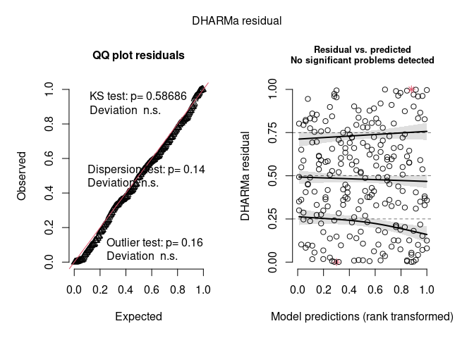
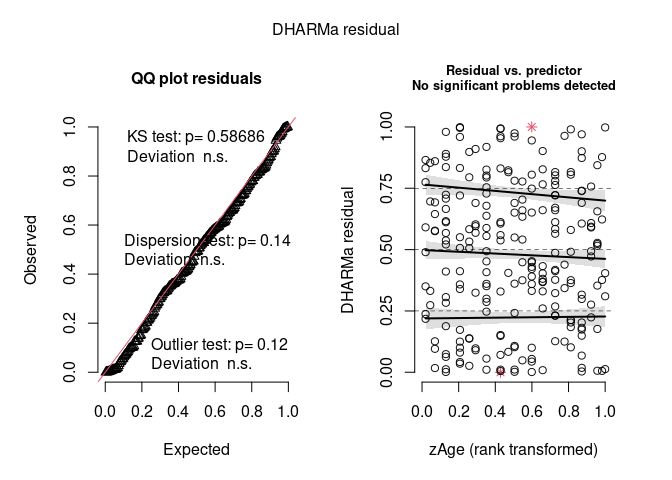

<!-- README.md is generated from README.Rmd. Please edit that file -->

# DHARMa.helpers

<!-- badges: start -->

[](https://github.com/Pakillo/DHARMa.helpers/actions/workflows/R-CMD-check.yaml)
[](http://hits.dwyl.com/Pakillo/DHARMAhelpers)
[](http://hits.dwyl.com/Pakillo/DHARMAhelpers)
<!-- badges: end -->

<https://pakillo.github.io/DHARMa.helpers>

DHARMa.helpers is an R package that facilitates checking fitted
statistical models via the
[DHARMa](https://cran.r-project.org/web/packages/DHARMa/vignettes/DHARMa.html)
package. By now, only Bayesian models fitted with
[brms](https://paul-buerkner.github.io/brms/) are implemented. See [this
blogpost](https://frodriguezsanchez.net/post/using-dharma-to-check-bayesian-models-fitted-with-brms/)
for a detailed explanation of the approach.

## Installation

``` r
# install.packages("remotes")
remotes::install_github("Pakillo/DHARMa.helpers")
```

## Example

``` r
library(brms)
library(DHARMa.helpers)
```

### Poisson regression

``` r
# Example model taken brms::brm()
# Poisson regression for the number of seizures in epileptic patients
fit1 <- brm(count ~ zAge + zBase * Trt + (1|patient),
            data = epilepsy, family = poisson(), refresh = 0)
#> Compiling Stan program...
#> Start sampling
simres <- dh_check_brms(fit1, integer = TRUE)
```



``` r
plot(simres, form = epilepsy$zAge)
```



``` r
DHARMa::testDispersion(simres)
```


    #> 
    #>  DHARMa nonparametric dispersion test via sd of residuals fitted vs.
    #>  simulated
    #> 
    #> data:  simulationOutput
    #> dispersion = 1.1911, p-value = 0.14
    #> alternative hypothesis: two.sided
